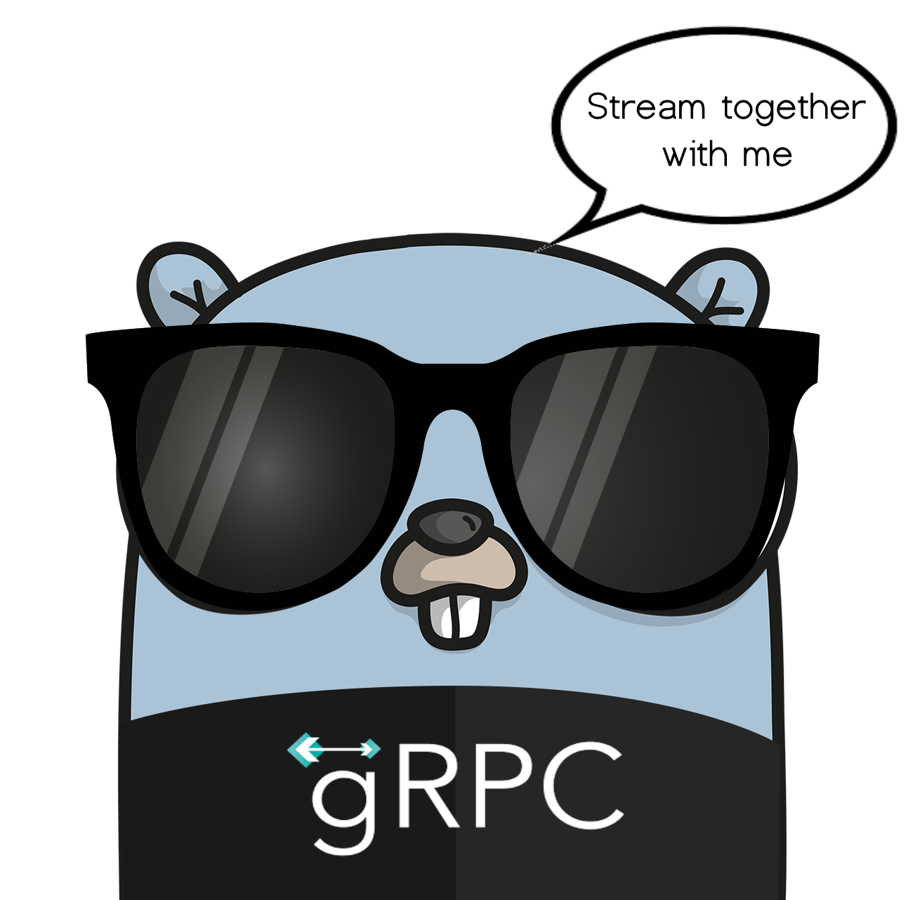

# Super cool Go con GRPC




## Esecuzione del Progetto

### 1. Prerequisiti

Prima di eseguire il progetto, è necessario ottenere una chiave API per utilizzare il servizio WeatherAPI. Questo servizio è completamente gratuito, e puoi ottenere la tua chiave API seguendo questi passi:

1. Visita il sito [WeatherAPI](https://www.weatherapi.com/).
2. Registrati e segui le istruzioni per ottenere la tua chiave API.
3. Una volta ottenuta, salva la chiave API in un luogo sicuro.

### 2. Configurare l'API Key come Variabile d'Ambiente

Per mantenere la tua chiave API sicura e fuori dal codice sorgente, configurala come una variabile d'ambiente. Segui questi passi:

#### Su Linux/MacOS:

```bash
export WEATHER_API_KEY=la-tua-api-key
```

#### Su Windows (nel terminale PowerShell):

```powershell
$env:WEATHER_API_KEY="la-tua-api-key"
```

Assicurati che la variabile d'ambiente `WEATHER_API_KEY` sia impostata correttamente prima di procedere.

### 3. Eseguire il Server

Una volta configurata la chiave API, puoi avviare il server:

1. Naviga alla directory `temperature_grpc_server`:

   ```bash
   cd temperature_grpc_server/cmd/server
   ```

2. Esegui il server:

   ```bash
   go run main.go
   ```

   Il server inizierà ad ascoltare le richieste gRPC.

### 4. Eseguire il Client

Con il server in esecuzione, ora puoi avviare il client per inviare richieste al server:

1. Apri un nuovo terminale e naviga alla directory `temperature_grpc_client`:

   ```bash
   cd temperature_grpc_client/cmd/client
   ```

2. Esegui il client:

   ```bash
   go run main.go
   ```

   Il client invierà una richiesta gRPC al server e riceverà una risposta con i dati di temperatura.


## Per il dettaglio del client e del server

- temperature_grpc_client/client.md
- temperature_grpc_server/server.md


## Approfondimenti sulla tecnologia scelta:


gRPC può essere considerato un successore di RPC, ed è leggero in termini di peso. Google lo ha sviluppato per la comunicazione tra microservizi e altri sistemi che necessitano di interagire. Ci sono diversi vantaggi nell'usare gRPC.

## Vantaggi di gRPC

- **Utilizza Protocol Buffers (Protobuf)** invece del JSON.
- **Costruito su HTTP/2** invece che su HTTP 1.1.
- **Generazione di codice incorporata**.
- **Alte prestazioni**.
- **Sicurezza SSL**.

Oltre ai vantaggi chiave menzionati sopra, gRPC promuove un design migliore per la tua applicazione. gRPC è orientato all'API, a differenza di REST che è orientato alle risorse. È anche asincrono per impostazione predefinita, il che significa che non blocca il thread su richiesta e può servire milioni di richieste in parallelo, garantendo un'alta scalabilità.

## Vantaggi di gRPC rispetto a REST

gRPC è circa sette volte più veloce di REST nel ricevere dati e circa dieci volte più veloce di REST nel trasmettere dati per un payload specifico. Questo è principalmente dovuto al pacchettamento compatto dei Protocol Buffers e all'uso di HTTP/2 da parte di gRPC.


## Tipi di RPC
gRPC supporta quattro tipi di metodi di servizio:

1. **RPC Unario**: il client invia una singola richiesta e ottiene una singola risposta, come una chiamata a funzione normale.
```protobuf
rpc SayHello(HelloRequest) returns (HelloResponse);
```

2. **RPC con Streaming Server**: il client invia una richiesta e riceve un flusso di risposte.
```protobuf
rpc LotsOfReplies(HelloRequest) returns (stream HelloResponse);
```

3. **RPC con Streaming Client**: il client invia un flusso di richieste e riceve una singola risposta.
```protobuf
rpc LotsOfGreetings(stream HelloRequest) returns (HelloResponse);
```

4. **RPC con Streaming Bidirezionale**: entrambe le parti inviano flussi di messaggi.
```protobuf
rpc BidiHello(stream HelloRequest) returns (stream HelloResponse);
```

## Utilizzo dell'API
### Lato Server
Il server implementa i metodi dichiarati dal servizio e gestisce le chiamate client utilizzando un server gRPC. La struttura gRPC decodifica le richieste in arrivo, esegue i metodi di servizio e codifica le risposte.

### Lato Client
Il client utilizza un oggetto locale noto come "stub" che implementa gli stessi metodi del servizio. Chiamando questi metodi, i parametri vengono invocati nel tipo di messaggio specificato dal protocol buffer e inviati al server, che a sua volta risponde con i messaggi corrispondenti.

## Sincrono vs Asincrono
Le chiamate RPC sincrone bloccano fino all'arrivo della risposta. Tuttavia, molte situazioni richiedono l'avvio di RPC senza bloccare il thread corrente. gRPC fornisce API sia sincrone che asincrone.

## Deadline/Timeout
gRPC consente ai client di specificare quanto tempo sono disposti ad attendere una risposta, dopo di che l'RPC viene terminato con un errore DEADLINE_EXCEEDED. Il server può verificare se l'RPC è scaduto.

## Terminazione e Cancellazione di un RPC
Client e server determinano localmente il successo di una chiamata, che potrebbe non corrispondere. Entrambe le parti possono annullare una chiamata RPC in qualsiasi momento.

## Metadata
La metadata sono informazioni su una chiamata RPC sotto forma di coppie chiave-valore. gRPC consente la gestione di metadata definiti dall'utente senza influenzare il funzionamento di base.

## Canali
Un canale gRPC fornisce una connessione a un server gRPC su un host e una porta specificati. Viene utilizzato per creare un client stub. I client possono specificare argomenti del canale per modificare il comportamento predefinito.

Ad esempio:
```go
conn, err := grpc.Dial("localhost:50051", grpc.WithInsecure())
```
https://signoz.io/blog/opentelemetry-grpc-golang/
## Author
Andrea Cavallo
