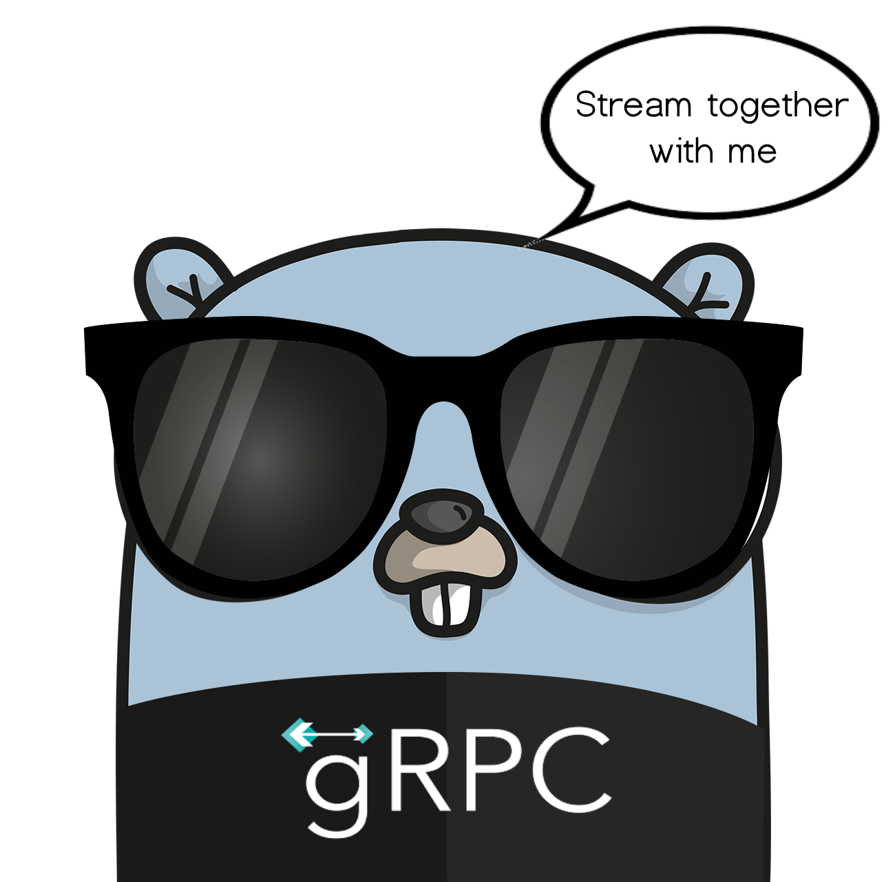
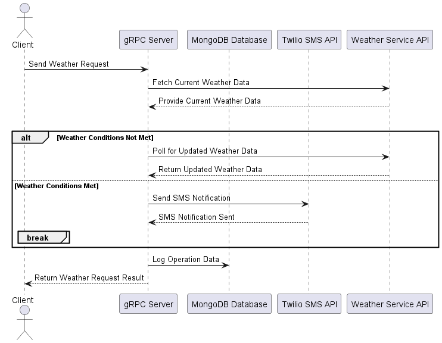
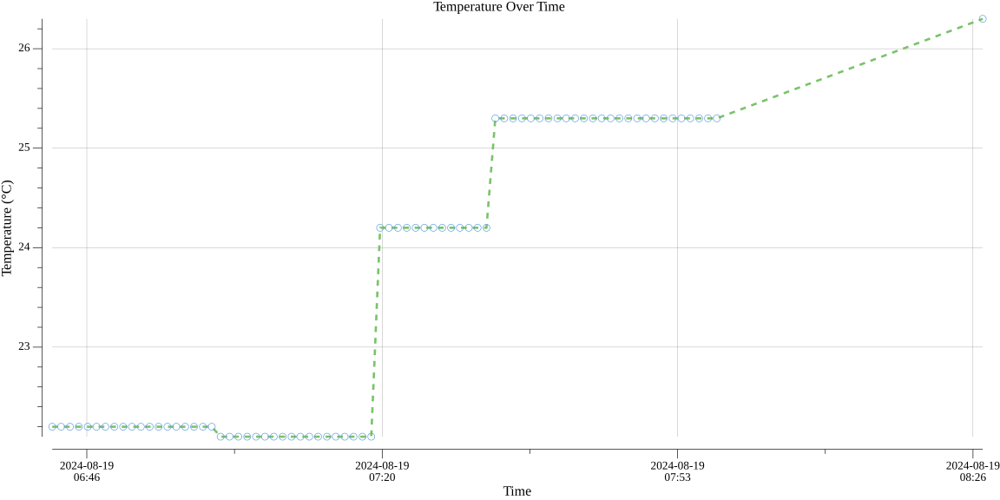

#  Real-Time Temperature Monitoring with Go and gRPC

## Introduzione

Questo progetto dimostra l'integrazione di servizi gRPC con il linguaggio Go,
fornendo un esempio completo di un server gRPC che serve dati di temperatura e un client gRPC che li consuma,
il tutto con una gestione avanzata delle metriche, connessione a MongoDB per persistere i dati, funzionalità di allerta tramite Twilio.
Il progetto utilizza Docker per facilitare l'impostazione dell'ambiente, inclusi la configurazione di MongoDB e altre dipendenze tipo jaeger.



[Click here for the English version](#english-version)

# Struttura del progetto


```text
├── api --> qua dentro il file .proto
│   ├── protos
│   │   ├── temperature.proto
│   ├── api.md
├── docker ---> tutto cio' relativo a docker
│   ├── docker-compose.yml
│   ├── init-mongo.js
│   ├── loki-config.yml
│   ├── otel-collector-config.yaml
│   ├── prometheus.yml
├── extra --> immagini del progetto
├── pkg --> pkg tutto quello che deve essere visibile e condiviso
│   ├── telemetry
│   ├── temperature
├── temperature_grpc_client -> il Client GRPC
│   ├── cmd
│   ├── plot
│   ├── service
│   ├── client.md
├── temperature_grpc_server --> il Server GRPC
│   ├── alert_twilio
│   │   ├── alert.go
│   ├── cmd
│   │   ├── server
│   │   │   ├── main.go
│   ├── mongodb --> connessione a MONGODB
│   │   ├── config
│   │   ├── temperature_repo
│   ├── service
│   │   ├── server.go
│   ├── server.md
├── .editorconfig
├── .gitignore
├── changelog.md
├── go.mod
├── go.sum
```

# Diagramma UML




# Esecuzione del Progetto

## 1. Prerequisiti

Prima di eseguire il progetto, è necessario ottenere una chiave API per utilizzare il servizio WeatherAPI. Questo servizio è completamente gratuito e puoi ottenere la tua chiave API seguendo questi passi:

1. Visita il sito [WeatherAPI](https://www.weatherapi.com/).
2. Registrati e segui le istruzioni per ottenere la tua chiave API.
3. Una volta ottenuta, salva la chiave API in un luogo sicuro.

## 2. Configurare l'API Key come Variabile d'Ambiente

Per mantenere la tua chiave API sicura e fuori dal codice sorgente, configurala come una variabile d'ambiente. Segui questi passi:

### Su Linux/MacOS:

```bash
export WEATHER_API_KEY=la-tua-api-key
```

### Su Windows (nel terminale PowerShell):

```powershell
$env:WEATHER_API_KEY="la-tua-api-key"
```

Assicurati che la variabile d'ambiente `WEATHER_API_KEY` sia impostata correttamente prima di procedere.

## 3. Build del Docker Compose

Assicurati di avere Docker installato e di avere accesso al file `docker-compose.yml`:

- Posizionati nella directory che contiene `docker-compose.yml`

## 4. Opzionale - Configurazione di Twilio

Se desideri inviare avvisi tramite Twilio, segui i seguenti passi per creare un account su Twilio e configurare le variabili d'ambiente:

Consulta: [Twilio WhatsApp Quickstart (Go)](https://www.twilio.com/docs/whatsapp/quickstart/go)

Configurare le seguenti variabili d'ambiente:

```bash
export TWILIO_ACCOUNT_SID=il-tuo-account-sid
export TWILIO_AUTH_TOKEN=il-tuo-auth-token
export TWILIO_PHONE_NUMBER=il-tuo-numero-di-telefono
export ALERT_PHONE_NUMBER=il-numero-di-telefono-per-gli-avvisi
```

## 5. Eseguire il Server

Una volta configurata la chiave API, puoi avviare il server:

1. Naviga alla directory `temperature_grpc_server`:

    ```bash
    cd temperature_grpc_server/cmd/server
    ```

2. Esegui il server:

    ```bash
    go run main.go
    ```

Il server inizierà ad ascoltare le richieste gRPC.

## 6. Eseguire il Client

Con il server in esecuzione, ora puoi avviare il client per inviare richieste al server:

1. Apri un nuovo terminale e naviga alla directory `temperature_grpc_client`:

    ```bash
    cd temperature_grpc_client/cmd/client
    ```

2. Esegui il client:

    ```bash
    go run main.go
    ```

Il client invierà una richiesta gRPC al server e riceverà una risposta con i dati di temperatura.

## Grafico della Temperatura

Ogni volta che arresti l'applicazione, in particolare il client, vedrai disegnato un grafico che mostrerà la variazione della temperatura.



## Per il dettaglio del client e del server

- temperature_grpc_client/client.md
- temperature_grpc_server/server.md

## Approfondimenti sulla tecnologia scelta

gRPC può essere considerato un successore di RPC, ed è leggero in termini di peso. Google lo ha sviluppato per la comunicazione tra microservizi e altri sistemi che necessitano di interagire. Ci sono diversi vantaggi nell'usare gRPC.

## Vantaggi di gRPC

- **Utilizza Protocol Buffers (Protobuf)** invece del JSON.
- **Costruito su HTTP/2** invece che su HTTP 1.1.
- **Generazione di codice incorporata**.
- **Alte prestazioni**.
- **Sicurezza SSL**.

Oltre ai vantaggi chiave menzionati sopra, gRPC promuove un design migliore per la tua applicazione. gRPC è orientato all'API, a differenza di REST che è orientato alle risorse. È anche asincrono per impostazione predefinita, il che significa che non blocca il thread su richiesta e può servire milioni di richieste in parallelo, garantendo un'alta scalabilità.

## Vantaggi di gRPC rispetto a REST

gRPC è circa sette volte più veloce di REST nel ricevere dati e circa dieci volte più veloce di REST nel trasmettere dati per un payload specifico. Questo è principalmente dovuto al pacchettamento compatto dei Protocol Buffers e all'uso di HTTP/2 da parte di gRPC.


## Autore

AndreaCavallo


-------------------------------------------------------------------------------------------------------------------

# English Version

# Super cool Go with GRPC


# Project Execution

## 1. Prerequisites

Before running the project, you need to obtain an API key to use the WeatherAPI service. This service is completely free, and you can get your API key by following these steps:

1. Visit the [WeatherAPI](https://www.weatherapi.com/) website.
2. Sign up and follow the instructions to get your API key.
3. Once obtained, save the API key in a safe place.

## 2. Configure the API Key as an Environment Variable

To keep your API key secure and out of the source code, configure it as an environment variable. Follow these steps:

### On Linux/MacOS:

```bash
export WEATHER_API_KEY=your-api-key
```

### On Windows (in PowerShell):

```powershell
$env:WEATHER_API_KEY="your-api-key"
```

Ensure the `WEATHER_API_KEY` environment variable is set correctly before proceeding.

## 3. Docker Compose Build

Ensure you have Docker installed and access to the `docker-compose.yml` file:

- Navigate to the directory that contains `docker-compose.yml`.

## 4. Optional - Twilio Configuration

If you wish to send alerts via Twilio, follow these steps to create a Twilio account and set up the environment variables:

Consult: [Twilio WhatsApp Quickstart (Go)](https://www.twilio.com/docs/whatsapp/quickstart/go)

Set the following environment variables:

```bash
export TWILIO_ACCOUNT_SID=your-account-sid
export TWILIO_AUTH_TOKEN=your-auth-token
export TWILIO_PHONE_NUMBER=your-phone-number
export ALERT_PHONE_NUMBER=alert-phone-number
```

## 5. Running the Server

Once the API key is configured, you can start the server:

1. Navigate to the `temperature_grpc_server` directory:

    ```bash
    cd temperature_grpc_server/cmd/server
    ```

2. Start the server:

    ```bash
    go run main.go
    ```

The server will start listening for gRPC requests.

## 6. Running the Client

With the server running, you can now start the client to send requests to the server:

1. Open a new terminal and navigate to the `temperature_grpc_client` directory:

    ```bash
    cd temperature_grpc_client/cmd/client
    ```

2. Start the client:

    ```bash
    go run main.go
    ```

The client will send a gRPC request to the server and receive a response with the temperature data.

## Temperature Graph

Whenever you shut down the application, especially the client, you will see a graph showing the temperature variation.


## Detailed Client and Server Documentation

- temperature_grpc_client/client.md
- temperature_grpc_server/server.md

## Insights into the Chosen Technology

gRPC can be considered a successor to RPC and is lightweight. Google developed it for communication between microservices and other systems that need to interact. There are several advantages to using gRPC.

## Advantages of gRPC

- **Uses Protocol Buffers (Protobuf)** instead of JSON.
- **Built on HTTP/2** instead of HTTP 1.1.
- **Built-in Code Generation**.
- **High Performance**.
- **SSL Security**.

In addition to the key advantages mentioned above, gRPC promotes better design for your application. gRPC is API-oriented, unlike REST, which is resource-oriented. It is also asynchronous by default, meaning it does not block the thread on request and can serve millions of requests in parallel, ensuring high scalability.

## Advantages of gRPC over REST

gRPC is about seven times faster than REST in receiving data and about ten times faster than REST in transmitting data for a specific payload. This is primarily due to the compact packing of Protocol Buffers and the use of HTTP/2 by gRPC.


## Author
Andrea Cavallo

